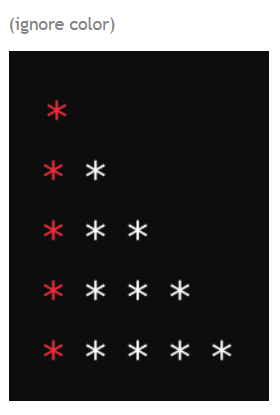

# Day 4: Loops

## Tasks/Activities:

### Activity 1: For Loop

- Task 1: Write a program to print numbers from 1 to 10 using a for loop.
- Task 2: Write a program to print the multiplication table of 5 using a for loop.

### Activity 2: While Loop

- Task 3: Write a program to calculate the sum of numbers from 1 to 10 using a while loop.
- Task 4: Write a program to print numbers from 10 to 1 using a while loop.

### Activity 3: Do ... While Loop

- Task 5: Write a program to print numbers from 1 to 5 using a do ... while loop.
- Task 6: Write a program to calculate the factorial of a number using a do ... while loop.

### Activity 4: Nested Loops

- Task 7: Write a program to print a pattern using nested for loops:

### Activity 5: Loop Control Statements

- Task 8: Write a program to print numbers from 1 to 10, but skip the number 5 using the continue statement.
- Task 9: Write a program to print numbers from 1 to 10, but stop the loop when the number is 7 using the break statement.

# Feature Request:

1. Number Printing Script: Write a script that prints numbers from 1 to 10 using a for loop and a while loop.
2. Multiplication Table Script: Create a script that prints the multiplication table of 5 using a for loop.
3. Pattern Printing Script: Write a script that prints a pattern of stars using nested loops.
4. Sum Calculation Script: Write a script that calculates the sum of numbers from 1 to 10 using a while loop.
5. Factorial Calculation Script: Create a script that calculates the factorial of a number using a do ... while loop.

# Achievement:

## By the end of these activities, students will:

- Understand and use for loops to iterate over a sequence of numbers.
- Utilize while loops for iteration based on a condition.
- Apply do ... while loops to ensure the loop body is executed at least once.
- Implement nested loops to solve more complex problems.
- Use loop control statements (break and continue ) to control the flow of loops.
